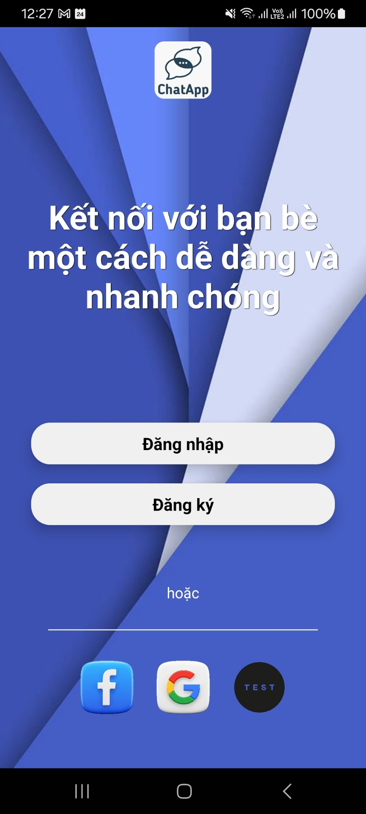
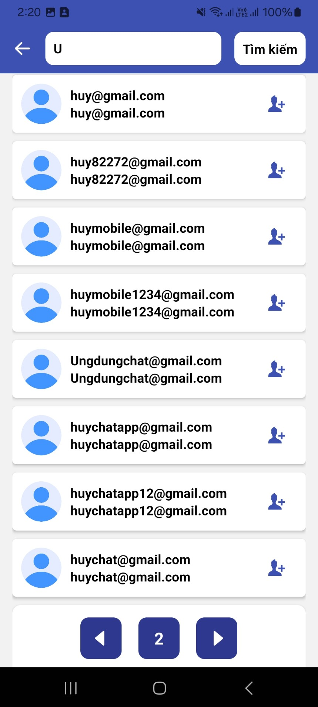
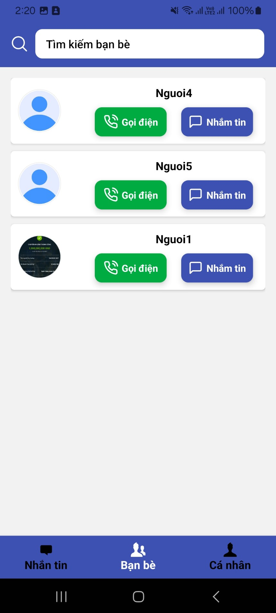
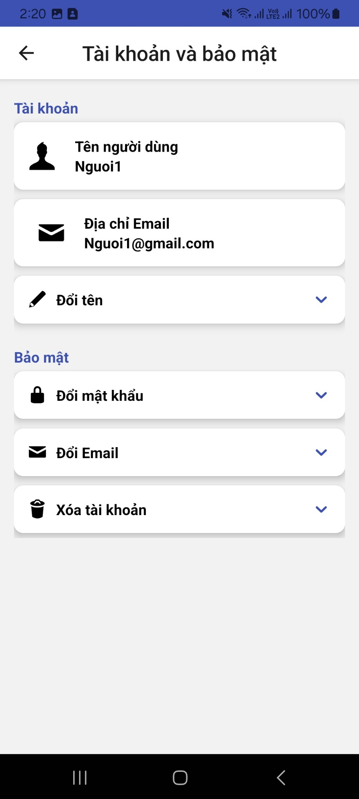

<h1 align="center">Ứng dụng nhắn tin trực tuyến</h1>
<h2 align="left">Bạn cần setup môi trường cho React Native, nếu chưa hãy làm theo hướng dẫn sau đây <a href="https://reactnative.dev/docs/set-up-your-environment">Setup React Native</a></h2>
<h2>Hướng dẫn cách Setup Project</h2>
<p>Sau khi clone project bạn cần chạy lệnh dưới đây để hoàn tất quá trình setup</p>
<h3>Setup client:</h3>
Đối với hệ điều hành Linux:

```
./setup.sh
```

Đối với hệ điều hành Windows:

```
start setup.exe
```

<h3>Setup server:</h3>
### Bạn cần clone server golang 
<a href="https://github.com/theanh201/Direct-Message-Backend.git">Server Golang</a>

## Giao diện ứng dụng Chat

<div style="display:flex; justify-content:space-between'">




</div>
